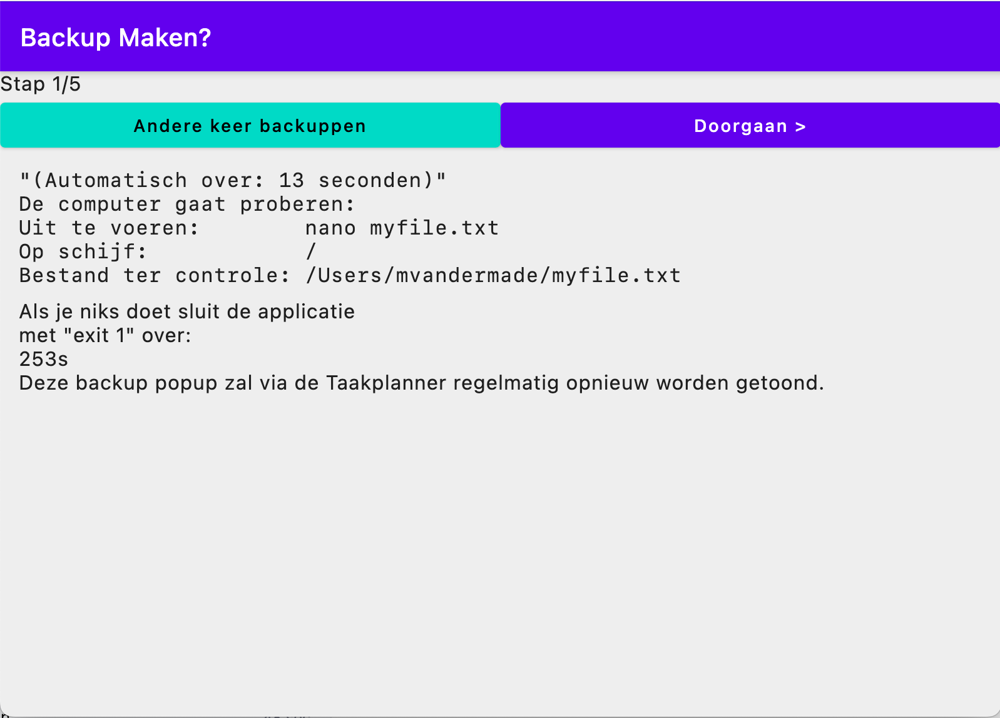

# made-confirm-launch

## 0 About
The project was built to be able to replace a .vbs file used under windows 11 but no longer works under windows 12

## 1. Introduction
The user is asked questions using popup style buttons:
- 

## 2. How to get started
### 2.1 General
- Select JDK17 (higher not supported right now)
- Run allTests task `./gradlew allTests` or to run: `./gradlew composeApp:run`
- Write some code!
# Note
- Ktlint is used for linting. CI fails when you forget it.
  - `./gradlew ktlintFormat`
- Customized editorconfig to match compose.
- Useful software:
  - Jetbrains IntelIJ
  - Jetbrains Fleet
  - Kotlin plugin for VSCode

### 2.2 Running jar
- Check if you have correct `java` version
- `java -jar org.example.project-PLATFORM-ARCH-1.0.0.jar`

### 2.3 Running
- Running things:
  - `./gradlew composeApp:run`
  - Or use your IDE short run configs.
  - Use @Preview annotation in devTools folder.
  - Use the following arguments for gradle to supply --args
With spaces in argument
```text
desktopRun --args="-checkDrivePath=/ -checkFilePath=/Users/Shared/myfile.txt -program=freefilesync" -argument='/Users/Shared/BatchRun.ffs_batch'" -DmainClass=MainKt --quiet
```
### 2.4 Running release jar
The msi function did not work, two x64 machines gave jdk error. So build the jar and run with the microsoft jdk: (feb 2024)
#### 2.4.1 Powershell
```powershell
& 'C:\Program Files\Microsoft\jdk-17.0.10.7-hotspot\bin\java.exe' -jar
C:\Users\Martijn\Desktop\made-cc-windows-x64-1.0.1.jar
-checkDrivePath='X'
-checkFilePath='BackupScripts\SyncSettingsX.ffs_batch'
-program='powershell' -dryRun
```

- Where X is drive letter like M:\. : seems not parseable so since 1.0.1 the app will add : and :\

## 3 Some pointers
If this warning occurs:
```text
Could not determine the dependencies of task ':composeApp:compileKotlinDesktop'.
> WindowsRegistry is not supported on this operating system.
```
Check if JDK == 17

## 4 Testing
Useful for testing:
```kotlin
cr.onRoot(useUnmergedTree = true).printToLog("TAG")
```

## Contributing
Please fork if you want any changes at this moment.

# Footnote
- Original KMP notes:
* `/composeApp` is for code that will be shared across your Compose Multiplatform applications.
  It contains several subfolders:
  - `commonMain` is for code that’s common for all targets.
  - Other folders are for Kotlin code that will be compiled for only the platform indicated in the folder name.
    For example, if you want to use Apple’s CoreCrypto for the iOS part of your Kotlin app,
    `iosMain` would be the right folder for such calls.


Learn more about
- [Kotlin Multiplatform](https://www.jetbrains.com/help/kotlin-multiplatform-dev/get-started.html)
- [Samples](https://www.jetbrains.com/help/kotlin-multiplatform-dev/multiplatform-samples.html)
- [KMP libraries](https://github.com/terrakok/kmp-awesome)
