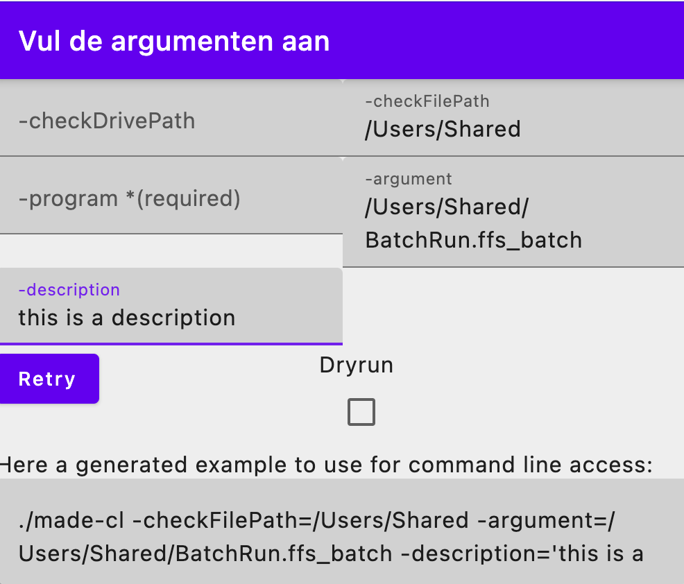
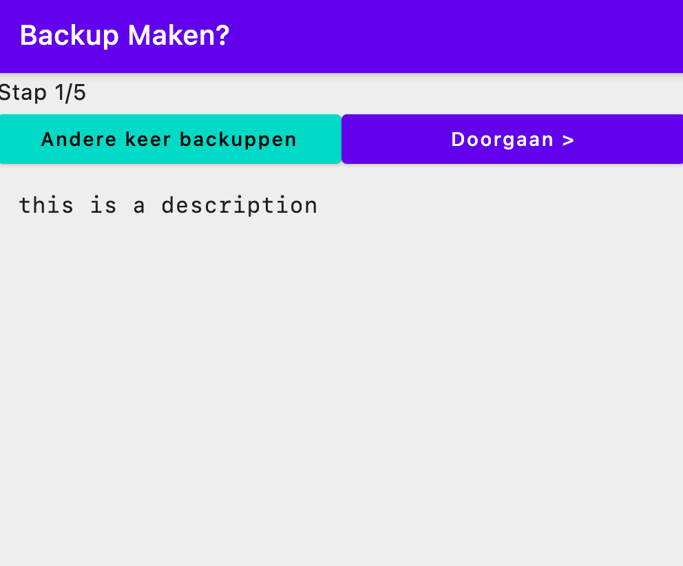
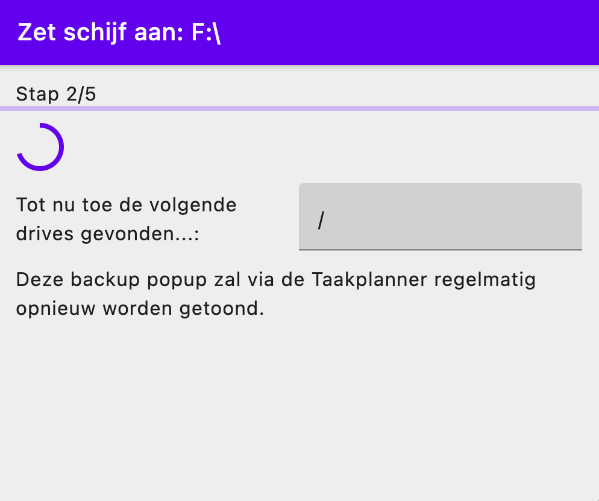
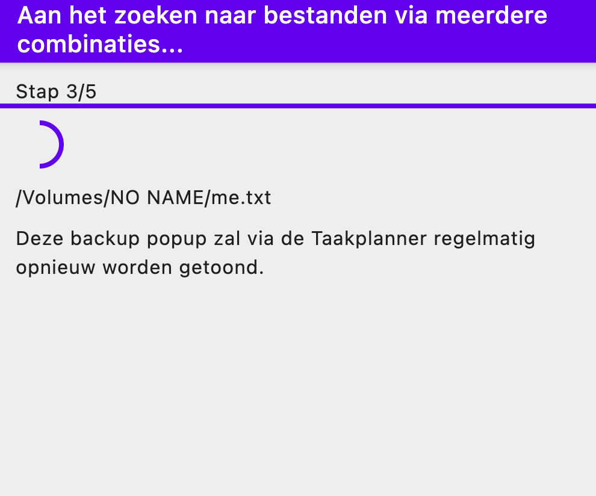
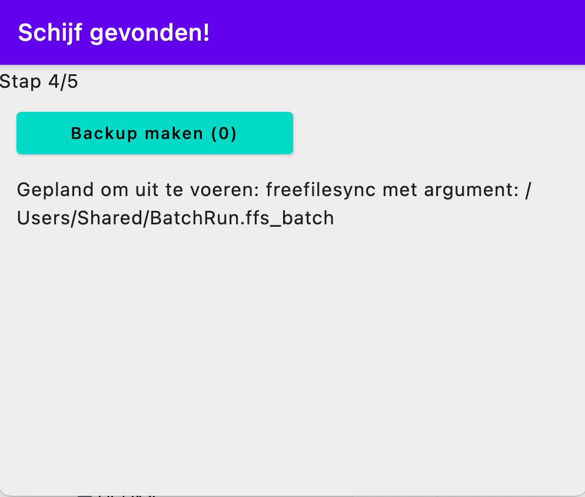

# made-confirm-launch

## Introduction
The user is asked questions using popup style buttons. The goal is to be able to let the user attach their correct backup drive before starting an external backup util.

1. When agument program is missing you get presented a helper:
2. The regular screen when fed correct arguments 
3. Checks if drive is present 
4. Checks if file is present 
5. Every check OK countdown in place because some disks are slow... 

### Operating systems
Follows the Kotlin Multiplatform compatibility: build your own executable using Gradle for now.

### Requirements
- JDK17 to build an executable for your own system.
- Right now the application is written in Dutch language, so you need to be able to read that.

## How to get started
- All platforms: `./gradlew packageUberJarForCurentOS`
- Windows: `./gradlew.bat packageReleaseMsi`
- Mac: `./gradlew packageReleaseDmg`
- Debian flavours: `./gradlew packageReleaseDeb`

- Typically you want to run the program periodically to enforce backups. You can run the program as-is and later supply the command line arguments you want, only -program= is mandatory.

### Developers
- Select JDK17 (higher not supported right now)
- Run allTests task `./gradlew allTests` or to run: `./gradlew composeApp:run`
- Write some code!
- Ktlint is used for linting. CI fails when you forget it.
  - `./gradlew ktlintFormat`
- Customized editorconfig to match compose.
- Useful software:
  - Jetbrains IntelIJ
  - Jetbrains Fleet
  - Kotlin plugin for VSCode

### Running in development mode
- Running things:
  - `./gradlew composeApp:run`
  - Or use your IDE short run configs.
  - Use @Preview annotation in devTools folder.
  - Use the following arguments for gradle to supply --args
With spaces in argument
```text
desktopRun --args="-checkDrivePath=/ -checkFilePath=/Users/Shared/myfile.txt -program=freefilesync -argument='/Users/Shared/BatchRun.ffs_batch'" -DmainClass=MainKt --quiet
```

## Some pointers
If this warning occurs:
```text
Could not determine the dependencies of task ':composeApp:compileKotlinDesktop'.
> WindowsRegistry is not supported on this operating system.
```
Check if JDK == 17

## Testing
Useful for testing:
```kotlin
cr.onRoot(useUnmergedTree = true).printToLog("TAG")
```

# Footnote
- Original KMP notes:
* `/composeApp` is for code that will be shared across your Compose Multiplatform applications.
  It contains several subfolders:
  - `commonMain` is for code that’s common for all targets.
  - Other folders are for Kotlin code that will be compiled for only the platform indicated in the folder name.
    For example, if you want to use Apple’s CoreCrypto for the iOS part of your Kotlin app,
    `iosMain` would be the right folder for such calls.

Learn more about
- [Kotlin Multiplatform](https://www.jetbrains.com/help/kotlin-multiplatform-dev/get-started.html)
- [Samples](https://www.jetbrains.com/help/kotlin-multiplatform-dev/multiplatform-samples.html)
- [KMP libraries](https://github.com/terrakok/kmp-awesome)
